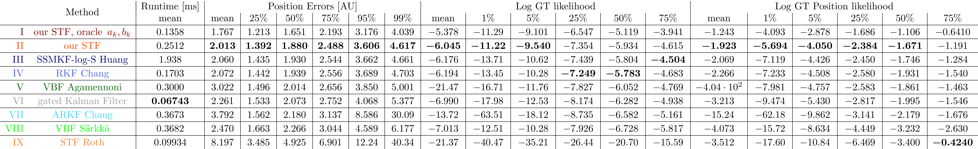

# Outlier Robust Student-t Filter
This repository presents an implementation of the Student-t Filter and comparison methods to other state-of-the-art robust Bayesian filtering methods.
We further provide a [short 3-minute animation](data/figures/AnimationExplainatory.mp4) visualizing the problem.

## Framework and Documentation
This project includes a framework focused on the flexibility and interchangeability of many moving parts, such that the various filtering methods can be tested in a wide variety of test cases. However, this results in a large amount of interconnected interfaces.  
Hence, we provide a detailed documentation of the framework and a bare-bones implementation of the presented concepts in a [minimal code example](minimalCodeExample.ipynb).  
To see the documentation, run the command `make html` while in the directory [``doc/``](doc/) and open the generated file `doc/build/html/index.html` in a local browser.

## Usage
To make use of our framework, we mainly provide two executable scripts.  
Firstly, [an interactive ipython notebook](scripts/showcase.ipynb), in which the influence of the various parameters on individual trajectories and filtering methods can be investigated. 
And secondly, the script [reproducing our presented results](scripts/quantitative_results.ipynb), which evaluates and compares the robust filtering methods on large sets of trajectories and performs the hyperparameter optimization for these methods. 

## Results
The rendered results of these experiments can be found in [data/figures](data/figures/). Such as

  

The methods we compare here are:
1.   our method when two scalar values in $\left[0,\frac{\nu+2}{\nu}\right]$ and $\left[0,\frac{\nu+8}{\nu+2}\right]$, depending on the noise processes, are known. This should show the potential of our method, especially when better estimators for these values are found
2.  our method with a simple estimator for the two scalar values, which doesn't require additional knowledge.
3.  [Yulong Huang, Yonggang Zhang, Yuxin Zhao, Peng Shi, and Jonathon Chambers, “A Novel Outlier-Robust Kalman Filtering Framework Based on Statistical Similarity Measure”, 2021.](https://doi.org/10.1109/TAC.2020.3011443)
4. [Guobin Chang, "Robust Kalman Filtering Based on Mahalanobis Distance as Outlier Judging Criterion", 2014.](https://doi.org/10.1007/s00190-013-0690-8)
5. [Gabriel Agamennoni, Juan Nieto and Eduardo Nebot, "An outlier-robust Kalman filter", 2011](https://doi.org/10.1109/ICRA.2011.5979605)
6. [Heinrich Meyr and Gerhard Spies, "The structure and performance of estimators for real-time estimation of randomly varying time delay", 1984](https://doi.org/10.1109/TASSP.1984.1164271)
7.  [Guobin Chang, "Kalman filter with both adaptivity and robustness", 2014.](https://doi.org/10.1016/j.jprocont.2013.12.017)
8.  [Simo Särkkä and Aapo Nummenmaa, "Recursive Noise Adaptive Kalman Filtering by Variational Bayesian Approximations", 2009](https://doi.org/10.1109/TAC.2008.2008348)
9.  [Michael Roth, Tohid Ardeshiri, Emre Özkan, and Fredrik Gustafsson, "Robust Bayesian filtering and smoothing using Student's t distribution.", 2017](https://doi.org/10.48550/arXiv.1703.02428)

Note that all these methods have sensitive hyperparameters. One additional advantage of our method is that its single hyperparameter can be derived from the frequency and strength of outliers in the observations.

## Licenses
Note that the code provided here is available under the BSD-3-Clause License.

